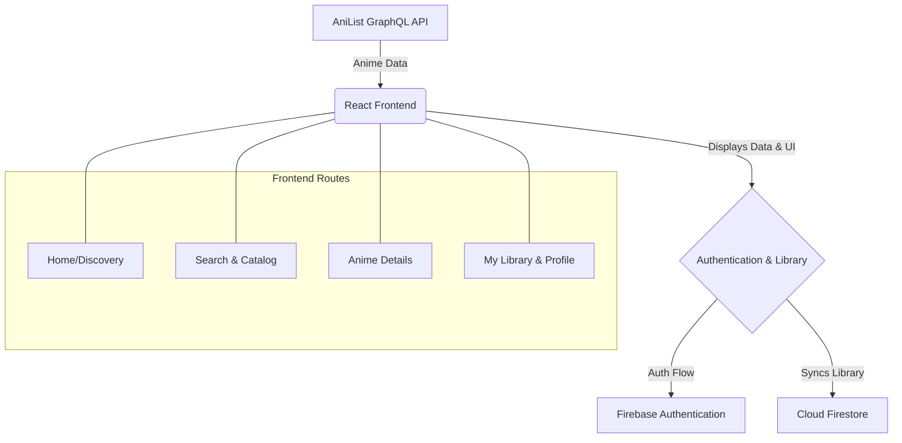

# AniHub

"Discover, explore, and keep track of your favorite anime."

A responsive anime discovery and personal library web application built with React. AniHub uses the AniList GraphQL API for anime data and Firebase Authentication + Cloud Firestore for user accounts and personalized anime libraries.

## 🚀 Live Demo

**[Live Link](https://anihub-anime.netlify.app)**

## 📖 About the Project

AniHub is a modern anime discovery application built with React. It allows users to discover trending anime, search for specific titles, browse a comprehensive catalog with advanced filters, and view detailed information for any anime. 

With a personalized account, users can manage a persistent watchlist and create custom collections to organize their personal library, keeping track of everything they've watched or plan to watch.

## ✨ Features

### 🎬 Anime Discovery
- **Home Dashboard:** Browse featured, popular, and trending anime.
- **Anime Details:** View comprehensive information including genres, seasons, formats, episodes, scores, and airing status.
- **Deep Dive:** Explore detailed character lists and staff credits provided by the AniList API.

### 🔎 Search
- **Instant Search:** Quickly find specific anime by title.
- **Responsive Layout:** Search results adapt elegantly to any screen size.

### 📚 Catalog
- **Advanced Filtering:** Filter the anime catalog by year, season, genre, format, and airing status.
- **Sorting & Pagination:** Sort results dynamically and browse smoothly using server-side AniList pagination.

### 👤 Authentication
- **Secure Access:** Powered by Firebase Email/Password authentication.
- **Complete Flow:** Registration, Login, Logout, and Forgot Password functionality.
- **Persistent Sessions:** Stay logged in across visits.

### ❤️ Watchlist
- **Personal Watchlist:** Save anime you want to watch later.
- **Cloud Sync:** Your watchlist is securely stored in Cloud Firestore and accessible from your personal library.

### 📁 Custom Collections
- **Organize Your Way:** Create entirely custom collections (e.g., *Favorite Anime*, *Watch Later*, *Best Action Anime*).
- **Manage Contents:** Add or remove anime from your collections dynamically.
- **Edit & Customize:** Modify collection names and descriptions.

### ⚡ Real-Time Library Updates
- **Live Sync:** Firestore real-time listeners ensure that library changes (like adding to your watchlist or a collection) appear immediately across the application without manual page refreshes.

### 👤 Profile
- **Account Overview:** View your personalized library statistics (Watchlist & Collections counts).
- **Profile Management:** Edit your display name and reset your password.

### 🗑️ Account Deletion
- **Full Control:** Users can permanently delete their account and all associated data.
- **Secure Deletion:** Requires recent-login password re-authentication.
- **Complete Wipe:** Safely deletes the Firebase Authentication account, profile data, watchlist, collections, and all nested anime items.

## 📱 Responsive Design

AniHub is designed to be fully responsive across all devices:
- **Desktop & Laptop**
- **Tablet**
- **Mobile**

The UI features adaptive anime grids, fluid navigation, responsive cards, scalable filters, and perfectly centered view-port modals.

## 🛠️ Tech Stack

### Frontend
- **React** 19
- **React Router** v7
- **JavaScript**
- **CSS** (Custom scoped design system)
- **Vite**

### Backend / Services
- **Firebase Authentication**
- **Cloud Firestore**

### API
- **AniList GraphQL API**

### Development Tools
- **Git & GitHub**
- **VS Code**

## 🏗️ Application Architecture



## 🔐 Firebase Architecture

Firebase Authentication identifies users, while Cloud Firestore securely stores user-specific library information. The database strictly isolates data per user using the following document structure:

```text
users/
└── {uid}/
    ├── profile
    │
    ├── watchlist/
    │   ├── {animeId}
    │   └── ...
    │
    └── collections/
        ├── {collectionId}
        │   └── items/
        │       ├── {animeId}
        │       └── ...
        │
        └── ...
```

## 🌐 AniList Integration

AniHub leverages the **AniList GraphQL API** for all anime data. This powerful integration enables:
- Efficient server-side filtering, sorting, and pagination in the Catalog.
- Rich, highly-detailed anime pages including characters, voice actors, and staff.
- Accurate genres, seasons, formats, and airing statuses directly from the database.

## 📂 Project Structure

```text
src/
├── api/             # GraphQL fetch logic
├── assets/
│   └── css/         # Scoped and global CSS files
├── component/       # Reusable UI components (Cards, Modals, Navbar, Footer)
├── context/         # React Context providers (AuthContext)
├── firebase/        # Firebase configuration and service layers
│   ├── auth.js
│   ├── firebaseConfig.js
│   └── firestore.js
├── pages/           # Application views (Home, Catalog, Profile, etc.)
├── App.jsx          # Route definitions
└── main.jsx         # Application entry point
```

## ⚙️ Getting Started

### 1. Clone repository
```bash
git clone https://github.com/your-username/anihub.git
```

### 2. Enter project directory
```bash
cd anihub
```

### 3. Install dependencies
```bash
npm install
```

### 4. Create environment file
Create a `.env` file in the root of the project to store your Firebase configuration.

## 🔑 Environment Variables

To run the project, add the following variables to your `.env` file:

```env
VITE_FIREBASE_API_KEY=your_firebase_api_key
VITE_FIREBASE_AUTH_DOMAIN=your_firebase_auth_domain
VITE_FIREBASE_PROJECT_ID=your_firebase_project_id
VITE_FIREBASE_STORAGE_BUCKET=your_firebase_storage_bucket
VITE_FIREBASE_MESSAGING_SENDER_ID=your_firebase_messaging_sender_id
VITE_FIREBASE_APP_ID=your_firebase_app_id
```
